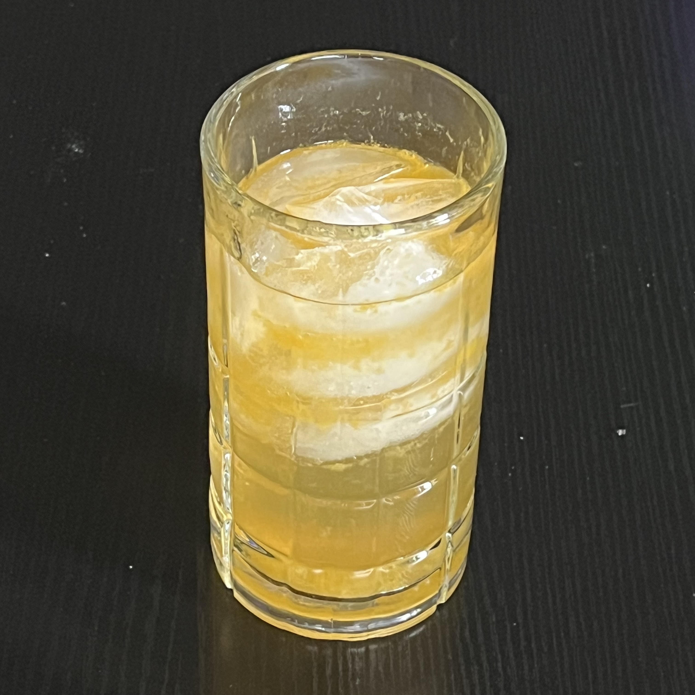

# Cocktails

## Fancy

### Anastasia and Sandman

#### Ingredients

- 1 large frozen cube of orange juice, no pulp
- 1/2 oz Suze
- 1 oz Pisco
- 1 oz Punt e Mes
- 1 oz tonic syrup
- Dash avocado, olive, or canola oil (optional)

#### Instructions

Combine liquids in a short glass, stir. Gently add orange cube. Top with dash of oil if desired.

### Day of Reckoning

#### Ingredients

- 1/2 lime juice
- 2 oz Dickel Rye
- 1 1/2 oz Angostura Amaro, or vodka with heavy dash of Angostura bitters
- 1 oz blueberry puree infused syrup
- Dash of balsamic vinigrette

#### Instructions

Combine liquids in a short glass, stir. Top with ice. Garnish with a thin, circular lime slice.

## Sweet

### Capri Sun

#### Ingredients

- 1/2 lemon juice
- 1 1/2 oz Chinola
- 2 oz Evan Williams Cherry Whiskey
- 4 oz Sprite

#### Instructions

Combine in a tall glass, stir. Top with ice.

### Cherry Lime Coke

#### Ingredients

- 1/2 lime juice
- 2 oz Evan Williams Cherry Whiskey
- 6 oz Cherry Coke

#### Instructions

Combine in a short glass, stir. Top with ice.

## Mules

### Fruity Mule

#### Ingredients

- 1/2 lime juice
- 2 oz Three Olives Loopy fruit loop flavored vodka
- 6 oz ginger beer

#### Instructions

Combine in a tall glass, stir. Top with ice.

### Yellow Mule

#### Ingredients

- 1/2 lemon juice
- 2 oz Deep Eddy Lemon vodka
- 6 oz ginger beer

#### Instructions

Combine in a tall glass, stir. Top with ice.

## Temples

### Surly Temple

### Golden Temple

#### Ingredients

- 1/2 lemon juice
- 2 oz Casamigos Tequila Anejo
- 1 1/2 oz Jack Rudy Grenadine or other pomegranite grenadine
- 6 oz Sprite

#### Instructions

Combine in a tall glass and stir. Top with ice. Garnish with Luxardo marchino cherries.

### Forbidden Temple